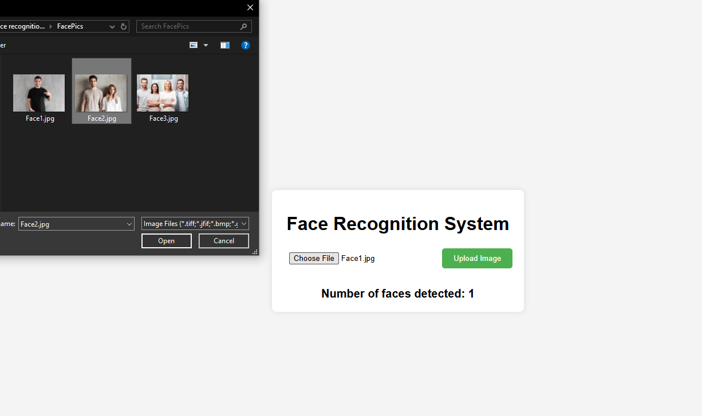

# Face Recognition System

This project is a simple face recognition web application built using Flask, face_recognition, OpenCV, and JavaScript. The app allows users to upload an image and detect how many faces are present in the image. The result is displayed on the webpage.

<p align="center">
  
</p>

<p align="center">
  
</p>

## Features

- **Face Detection**: Upload an image and the system will detect the number of faces using the powerful `face_recognition` library.
- **Real-Time Results**: The number of faces detected is instantly shown without refreshing the page, thanks to AJAX.
- **User-Friendly Interface**: Simple, intuitive design for easy navigation and interaction.
- **Fast and Efficient**: Powered by Flask for a lightweight and speedy experience.

## Requirements

Make sure you have the following installed to run the project:

- Python 3.x
- **Flask**: For building the web application.
- **face_recognition**: For detecting faces in images.
- **OpenCV**: For image processing and manipulation.
- **numpy**: For handling image arrays and data.

## Installation

1. **Clone the Repository**:
    ```bash
    git clone https://github.com/imranfaiz786/Python-Face-Recognition.git
    cd Python-Face-Recognition
    ```

2. **Install Required Libraries**:
    ```bash
    pip install -r requirements.txt
    or
    pip install flask face_recognition opencv-python numpy
    ```

3. **Run the Application**:
    ```bash
    python app.py
    ```

## How it Works

### Backend (Flask):
The `app.py` file serves as the backend of the web application. It provides two routes:
- `/`: Renders the HTML page with the file upload form.
- `/recognize`: Receives the uploaded image, uses the `face_recognition` library to detect faces, and returns the count of faces in the image as a JSON response.

### Frontend (HTML/JavaScript):
The `index.html` page contains the form to upload images and displays the result after face detection. JavaScript (AJAX) is used to send the image file to the server without reloading the page, and the result is dynamically displayed.

### Face Detection:
The `face_recognition` library is used to detect faces in the uploaded image. The result is the number of faces detected, which is then displayed on the webpage.

## Contributing

Feel free to fork the repository and create pull requests. Contributions are welcome!

## License

This project is licensed under the **MIT License**.
